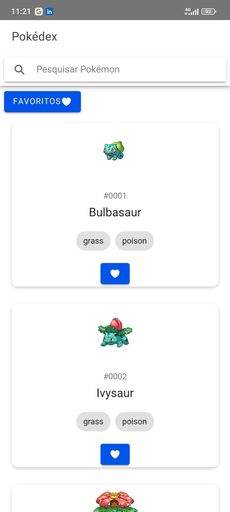
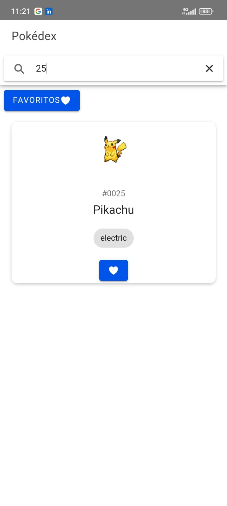
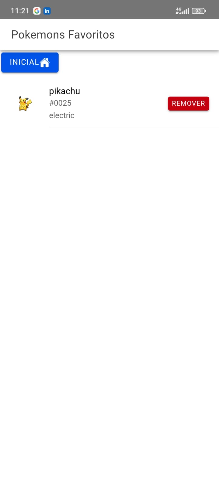

# Pokédex App

Este projeto é uma Pokédex, desenvolvida usando Ionic e Angular, que permite visualizar, pesquisar e favoritar Pokémon. A aplicação busca dados da PokeAPI e os exibe de maneira organizada e interativa.

<div>
  
  
  
</div>

## Abordagem Utilizada

1. **Estrutura Modular**: O projeto foi dividido em módulos e serviços, garantindo uma estrutura de código limpa e organizada.
2. **Serviço de Dados**: Utilização de um serviço centralizado (`PokemonService`) para gerenciar todas as chamadas de API e transformar os dados recebidos.
3. **Pesquisa Dinâmica**: Implementação de um mecanismo de pesquisa dinâmica, que filtra os Pokémon à medida que o usuário digita.
4. **Armazenamento Local**: Uso do `localStorage` para gerenciar a lista de Pokémon favoritos, permitindo uma experiência personalizada e persistente.
6. **Interface de Usuário Responsiva**: Design responsivo utilizando componentes do Ionic, garantindo uma experiência de usuário consistente em diferentes dispositivos.
7. **Código Limpo**: Esforço para manter o código limpo e seguindo boas práticas de desenvolvimento.

## Estrutura do Projeto

- **src/app/home**: Página inicial que lista e busca Pokémon.
- **src/app/details**: Página de detalhes de um Pokémon específico.
- **src/app/favorites**: Página de gerenciamento de Pokémon favoritos.
- **src/app/api/pokemon.service.ts**: Serviço responsável por interagir com a PokeAPI e gerenciar dados dos Pokémon.

## Como Executar

1. Clone o repositório:
    ```sh
    git clone https://github.com/PedroSantiagoDev/pokemon.git
    cd pokemon
    ```

2. Instale as dependências:
    ```sh
    npm install
    ```

3. Execute a aplicação:
    ```sh
    ionic serve
    ```
